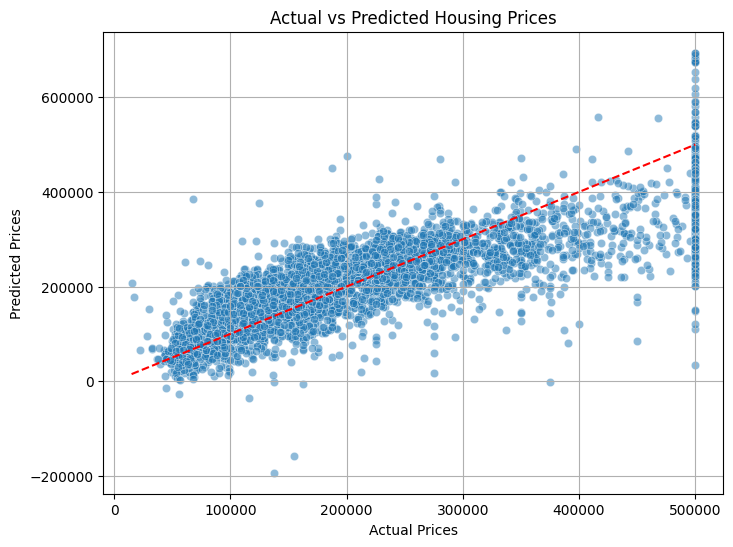

# Housing Price Prediction

This project uses the California Housing dataset to predict housing prices based on various features. We explore the dataset, perform data preprocessing, and apply a simple Linear Regression model to predict house prices.

---

## Dataset

The dataset contains information about various features of homes in California. Key features include:

- longitude: Longitude of the house

- latitude: Latitude of the house

- housing_median_age: Median age of the houses

- total_rooms: Total number of rooms in the house

- total_bedrooms: Total number of bedrooms in the house

- population: Population in the neighborhood

- households: Number of households in the area

- median_income: Median income of the households

- median_house_value: Target variable - the median house value (what we aim to predict)

- ocean_proximity: Proximity to the ocean (categorical feature)

---

## Requirements

This project uses the following Python libraries:

- pandas
- scikit-learn
- matplotlib
- seaborn

Note: To install the required libraries, you can run:

```bash
pip install -r requirements.txt
```

- requirements.txt is included within this directory.

---

## Project Structure 

```plaintext
Project/
├── H_Prediction.ipynb
├── requirements.txt
└── image.png

---

## Steps

1. Data Loading: Load the California Housing dataset.

2. Data Exploration: Inspect the first few rows, summary statistics, and check for missing values.

3. Data Preprocessing:
- Handle missing values by filling them with the median.
- One-hot encode the ocean_proximity categorical feature.

4. Feature Engineering:
- Define the features (X) and the target (y).
- Scale the features using StandardScaler.

5. Model Training:
- Train a Linear Regression model.
- Split the data into training and testing sets (80% train, 20% test).


6. Model Evaluation:
- Evaluate the model using Mean Absolute Error (MAE) and R² Score.
- Plot the actual vs predicted house prices.

---

## Code Explanation

- Data Exploration: We explore the dataset to understand its structure and clean it for further analysis.
- Preprocessing: Missing values are handled, and categorical features are one-hot encoded.
- Modeling: A Linear Regression model is used to make predictions.
- Evaluation: We evaluate model performance with key metrics and visualize the results.

---

## Results

The model was trained and evaluated with the following results:

- Mean Absolute Error (MAE): 50670.73824097193
- R² Score: 0.6254240620553605

---

## Sample Plot

The scatter plot below compares the predicted house prices with actual prices:



---

## Future Improvements

- Model Experimentation: Try different models like Random Forest or Gradient Boosting to improve performance.
- Hyperparameter Tuning: Use techniques like Grid Search or Randomized Search to tune the model.
- Cross-Validation: Implement cross-validation to better assess model performance.
- Feature Engineering: Experiment with creating new features (e.g., rooms per household).
- Outlier Detection: Handle outliers to improve model accuracy.

---

## Conclusion

This project demonstrates the use of Linear Regression for predicting housing prices. Future work can explore more advanced models and techniques to improve prediction accuracy.

---

## Author

Dennis Alejandro Guerra Calix -- AGCalixto 

